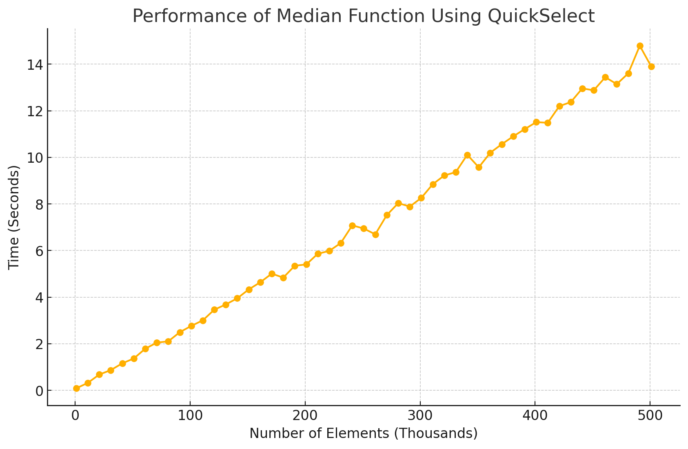

# median
Find the median of an array of numbers in `O(n)` _(linear)_ average time, based on [Nicolas Devillard's Fast median search: an ANSI C implementation](http://ndevilla.free.fr/median/median/src/quickselect.c)

