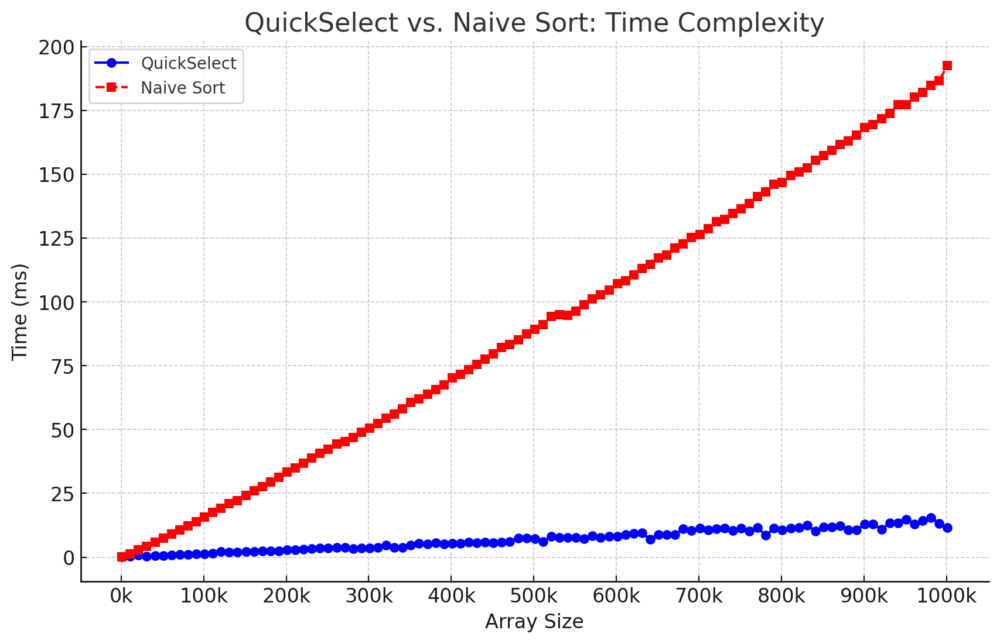

# median
Find the median of an array of numbers in `O(n)` _(linear)_ average time, based on [Nicolas Devillard's Fast median search: an ANSI C implementation](http://ndevilla.free.fr/median/median/src/quickselect.c)


Benchmarked using a dataset of sizes that are used to create an array of that size with randomized numbers in it. Each size is used to measure the performance of both the quickselect median and the naive sort median approaches. The average of 3 iterations per size were taken.

**Dataset for plot**
```json
{"sizes":[1000,11000,21000,31000,41000,51000,61000,71000,81000,91000,101000,111000,121000,131000,141000,151000,161000,171000,181000,191000,201000,211000,221000,231000,241000,251000,261000,271000,281000,291000,301000,311000,321000,331000,341000,351000,361000,371000,381000,391000,401000,411000,421000,431000,441000,451000,461000,471000,481000,491000,501000,511000,521000,531000,541000,551000,561000,571000,581000,591000,601000,611000,621000,631000,641000,651000,661000,671000,681000,691000,701000,711000,721000,731000,741000,751000,761000,771000,781000,791000,801000,811000,821000,831000,841000,851000,861000,871000,881000,891000,901000,911000,921000,931000,941000,951000,961000,971000,981000,991000,1001000],"quickselectTimes":[0.09855565925439198,0.31015299757321674,0.7995413293441137,0.44362499316533405,0.5823333362738291,0.6425560017426809,0.8496943364540736,1.0006803373495738,0.9955973327159882,1.2076806674400966,1.34375,1.5447223385175068,2.186986337105433,2.055597002307574,1.9510416686534882,2.255652671058973,2.2477359970410666,2.3758053332567215,2.4098476618528366,2.4727776646614075,2.8410000006357827,2.9687640021244683,3.055500333507856,3.3497363328933716,3.6791806717713675,3.684708664814631,3.7680000017086663,3.7811940014362335,3.4391250014305115,3.5526526669661203,3.6414166688919067,3.8144719998041787,4.814319332440694,3.905806005001068,3.865027671058973,4.799235999584198,5.445222333073616,5.201472337047259,5.663222670555115,5.186249663432439,5.477028002341588,5.3788330008586245,5.91947199900945,5.575235669811566,5.895528003573418,5.593652332822482,5.804194668928782,6.094486330946286,7.4141670018434525,7.452096993724505,7.169167007009189,6.058583329121272,8.122027660409609,7.696472331881523,7.664208337664604,7.794888998071353,7.313639005025228,8.375805671016375,7.798194999496142,8.04899999499321,8.198055669665337,8.880291337768236,9.396263663967451,9.591527670621872,6.9305973301331205,8.852125331759453,8.93002732594808,8.860208332538605,11.125485996405283,10.333347002665201,11.277666668097178,10.76601399978002,11.152750333150228,11.255875006318092,10.411041662096977,11.286805664499601,10.264597336451212,11.56604133049647,8.528430670499802,11.279792000850042,10.756569330890974,11.35976366698742,11.69729166229566,12.534611329436302,10.306430334846178,11.79333333671093,11.90783333281676,12.378708337744078,10.78072233001391,10.755041673779488,12.961236000061035,12.970666666825613,10.930083329478899,13.332833672563234,13.337680667638779,14.768277669946352,13.052291666467985,14.346680670976639,15.584999665617943,13.202527672052383,11.517569661140442],"naiveSortMedianTimes":[0.2005553344885508,1.3670416623353958,2.8021246641874313,4.365055665373802,5.833166336019834,7.468458329637845,9.10436133046945,10.564736331502596,12.268722335497538,13.919125323494276,15.623541335264841,17.529652670025826,19.202638670802116,21.08097232878208,22.220458328723907,24.23904166618983,25.97033300002416,27.665555665890377,29.522278000911076,31.331597333153088,33.245124995708466,35.02766666313013,36.82572199900945,38.811430330077805,40.61232000589371,42.31301400065422,44.37154166897138,45.37533333400885,46.83881933490435,48.84569400052229,50.580527340372406,52.30416699747244,54.344346995155014,56.0887776662906,58.06334699690342,60.630597338080406,62.03934733569622,63.90434733529886,65.66963866353035,67.55488900343578,70.2574583341678,71.6654446721077,73.47191666563351,75.52520833412807,77.66011099517345,79.66720866660278,82.04227799673875,83.33611099918683,85.0975693364938,87.4019723335902,89.34320833285649,91.08440300822258,94.3809719979763,94.92769433557987,94.70291665693124,96.42988899846871,98.96581966678302,101.24038866659005,102.8715556661288,104.63736099998157,107.08490299681823,108.37073600292206,110.47538900375366,113.10380566120148,114.74181933204333,117.08684733510017,118.32970800002416,120.98204166690509,122.6780136724313,125.11136133472125,126.4613333294789,128.69255533317724,131.31319467226663,132.2880833297968,134.50495799879232,136.46244466801485,138.48220800360045,141.35069432854652,143.00255566338697,146.01030566791692,146.66470866898695,149.50005567073822,150.7826386640469,152.53872199853262,155.4318613310655,157.23390266795954,159.3803189943234,161.5300836612781,163.0260276645422,165.33730532725653,168.2871666699648,169.53301399946213,171.65204200148582,173.83958332737288,177.13981967171034,177.32406966884932,180.28323600192866,181.9847503354152,184.8279026647409,186.58779200414816,192.53336133559546]}
```



